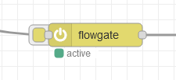

# FlowGate Node for Node-RED

FlowGate is a custom node for [Node-RED](https://nodered.org/) that allows you to control the flow of messages through your automation workflows. It acts as an intelligent gate: when active, it lets messages pass; when inactive, it blocks messages from continuing through. This makes it easy to dynamically enable or disable parts of your Node-RED flows without requiring a deploy.

## Features

- **Two-State Toggle Button**: Control whether messages pass through or are blocked with a simple on/off button.
- **Runtime Control**: Change the state of FlowGate during runtime without redeploying your flows.
- **Intuitive UI Integration**: Visual representation of the node's state (active or inactive) directly within the Node-RED editor.

## Installation

To install FlowGate in your Node-RED environment, use the following command:

```sh
npm install node-red-contrib-flowgate-node
```

Alternatively, you can install it directly from the Node-RED palette manager by searching for "FlowGate".

## Usage

1. Drag and drop the **FlowGate** node from the function category into your flow.
2. Configure the node as required:
   - **Name**: Set a name for the FlowGate instance to help identify it in your flows.
   - **Active State**: Default state for the FlowGate (active or inactive).
3. Connect it to other nodes to control which messages should continue through based on its state.

The state of the node can be toggled during runtime without the need to redeploy the flow, making it flexible and easy to adjust.



## Example Use Cases

- **Conditional Message Flow**: Use FlowGate to enable or disable parts of your workflow based on specific runtime conditions.
- **Debugging Helper**: Isolate portions of a flow by disabling FlowGate to focus on troubleshooting other parts.

## Example Flow

Here is a simple example to demonstrate how to use FlowGate in a flow:

1. Add an **Inject** node to initiate a message.
2. Connect the **Inject** node to the **FlowGate** node.
3. Connect the **FlowGate** node to a **Debug** node to see the output.

When the **FlowGate** node is active, messages injected by the **Inject** node will pass through to the **Debug** node, allowing you to see the output. When the **FlowGate** node is inactive, the messages will be blocked, and nothing will reach the **Debug** node.

### Example Flow JSON

Below is the JSON representation of an example flow using FlowGate:

```json
[{"id":"4f397f3a1bdaef61","type":"inject","z":"84c82b718b328987","name":"","props":[{"p":"payload"},{"p":"topic","vt":"str"}],"repeat":"","crontab":"","once":false,"onceDelay":0.1,"topic":"","payload":"","payloadType":"date","x":420,"y":160,"wires":[["24d721d5b766e5ac"]]},{"id":"ee24781f808d8f1c","type":"debug","z":"84c82b718b328987","name":"debug","active":true,"tosidebar":true,"console":false,"tostatus":false,"complete":"payload","targetType":"msg","statusVal":"","statusType":"auto","x":970,"y":180,"wires":[]},{"id":"24d721d5b766e5ac","type":"flowgate","z":"84c82b718b328987","name":"","active":true,"x":720,"y":180,"wires":[["ee24781f808d8f1c"]]}]
```

## License

This project is licensed under the MIT License.

## Contribution

Feel free to fork the repository and submit pull requests. Contributions are always welcome to enhance the functionality and usability of FlowGate.

## Acknowledgements

FlowGate was inspired by the need to control Node-RED message flows easily during runtime. Special thanks to the Node-RED community for the tools and support.

---

For more information and documentation, visit the [Node-RED website](https://nodered.org/).
